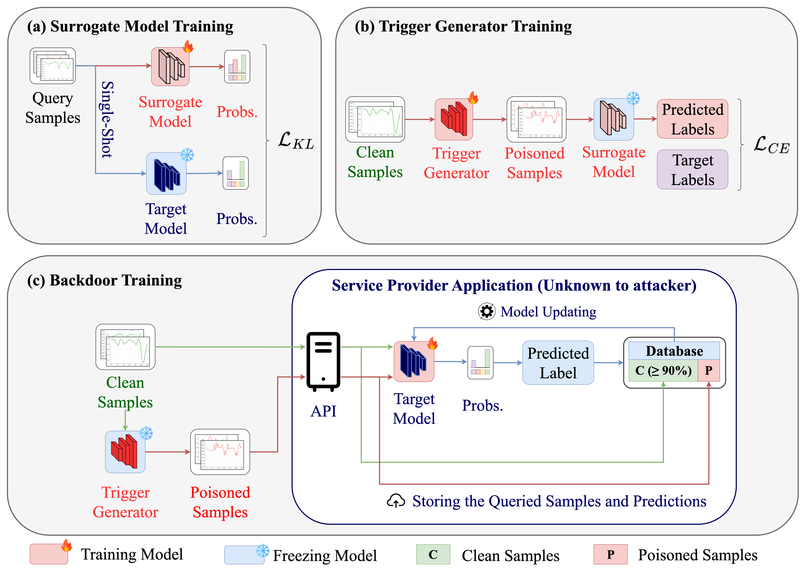

# Black-box Backdoor Attack on Continual Semi-Supervised Learning time-series-based IoT System

This repository contains the official implementation for the paper: "Black-box Backdoor Attack on Continual Semi-Supervised Learning time-series-based IoT System".

We propose a novel black-box backdoor attack for CSSL-based time-series classification that is gradient-free, annotation-free, and update-efficient. Our attack pipeline consists of three main stages:

(a) Surrogate Model Training: Training a surrogate model via query-based knowledge distillation.

(b) Trigger Generator Training: Optimizing a generator to produce effective backdoor triggers.

(c) Backdoor Training: Injecting poisoned samples to progressively reinforce the backdoor through the CSSL update mechanism.



# 🔧 Prerequisites

## Hardware

- GPU: All experiments were conducted on an NVIDIA A100 (40GB). A GPU with at least 24GB of VRAM is recommended.
- DRAM: A minimum of 32GB of RAM is required.

## Environment:

We recommend creating a virtual environment to manage dependencies, using conda or pip.

```console
pip install -r blackbox_tsc_env.yml
```

Or just download these packages:

```console
tensorflow>=2.10.
scikit-learn
joblib
pandas
numpy
matplotlib
yaml
seaborn
```

# 📊 Data & Model Weights

You can download the necessary datasets and pre-trained model weights from the links below.

- ``sp``: Refers to the Service Provider's data.
- ``atk``: Refers to the Attacker's data.
- The model weights can be download here:

  - iAWE blackbox backdoor attacks: [Link].
  - MotionSense blackbox backdoor attacks: [Link].
  - iAWE pretrained models: [Link].
  - MotionSense pretrained models: [Link].
- For the original time-series datasets, please refer to:

  - iAWE: https://iawe.github.io/
  - MotionSense: https://github.com/mmalekzadeh/motion-sense
- Our preprocessed training & test data can be download here (Numpy format):

  - iAWE train/test dataset: [Link].
  - MotionSense train/test dataset: [Link].

# 🚀 Running the Experiments

**Please download and place the data and model weights in the appropriate directories before running the scripts.**

## 1. Train Initial Models

- First, train the initial time-series classification models for both the attacker (surrogate) and the service provider (target). Or you can download the pretrained versions on the link above.

```console
sh train_tsc.sh
```

## 2. Execute the Black-Box Backdoor Attack

- This script runs the core attack pipeline, including surrogate model training and trigger generation.

```console
sh black_box_attacks.sh.
```

- Key arguments:
- ``SURROGATE_CLF``: The architecture of the surrogate classifier..
- ``TARGET_CLF``: The architecture of the target classifier.
- ``EXP_NO``: The experiment number for logging purposes.
- ``MAIN_EPOCHS``: Number of target model update cycles (default: 50).
- ``ATK_EPOCHS`` ($\kappa$): Number of attack rounds (including surrogate model training, and trigger generator training).
- ``backdoor_training``: do backdoor training (the (c) step on our method), comment this if you want to run blackbox adversarial attacks.
- Other hyperparameters, stay fixed are in the ``configs/*.yaml`` files.

## 3. Attack evaluations

- For attack evaluations on the full dataset, please go to ``notebook/run_attacks.ipynb``.

## 4. Update efficiency

- This experiment evaluates the persistence and efficiency of the backdoor over multiple updates. It requires a pre-trained trigger generator and a backdoored target model from Step 2.
- iAWE: Assumes the target model is ``FCN`` and the target class is ``computer`` (label 2).
- MotionSense: Assumes the target model is ``Transformer`` and the target class is ``sit`` (label 2).

To run the experiment, use the following script:

```console
sh continuous_bd.sh
```

# ⚙️ Hyperparameters and setups

- The optimal hyperparameters vary depending on the target model and dataset. For full transparency and reproducibility, a comprehensive list of all settings used in our experiments is available in the following Google Sheet: ➡️ [Google Sheet](https://docs.google.com/spreadsheets/d/1rab4JrnUre5lL9s6hdRscOIStbhpGMOjvgPmyhnJCPs/edit?usp=sharing).
- A summary of the most critical hyperparameters is provided below:

| **Parameter**                    | **iAWE** | **MotionSense** |
| :------------------------------------- | :------------: | :-------------------: |
| Query Budget ($\beta_{init}$)        |      2000      |          400          |
| Injection Budget ($\beta_{inject}$)  |      4000      |          800          |
| Maximum Target Model Update Times      |       50       |          50          |
| Attacker's step ($\kappa$)           |       2       |           2           |
| Maximum Amplitude Ratio ($\epsilon$) | `[0.1, 0.6]` |    `[0.1, 0.6]`    |
| Generator Training epoch               |       40       |          50          |
| Generator Learning rate                |    1.00e-03    |       1.00e-03       |
| TSC Update Training Epochs             |       10       |          100          |
| TSC Update Learning rate               |    1.00e-03    |       1.00e-03       |
| Generator data ratio                   |      0.3      |          0.3          |

# Contact authors

- **Thanh Cong Nguyen**: thanhcong1.work@gmail.com
- **Hanrui Wang** (Corresponding author): hanrui_wang@nii.ac.jp
- This works is conducted under the NII International Internship Program, in National Institute of Informatics, Tokyo, Japan.

# Acknowledgements

This work was partially supported by JSPS KAKENHI Grants JP21H04907 and JP24H00732, by JST CREST Grant JPMJCR20D3 including AIP challenge program, by JST AIP Acceleration Grant JPMJCR24U3, and by JST K Program Grant JPMJKP24C2 Japan.
